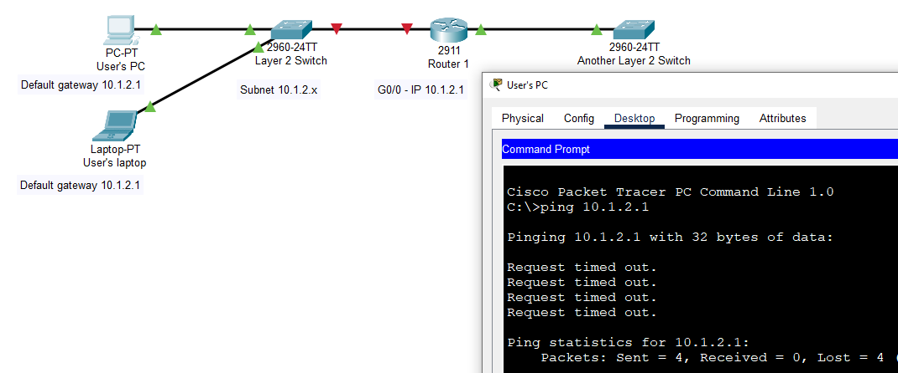
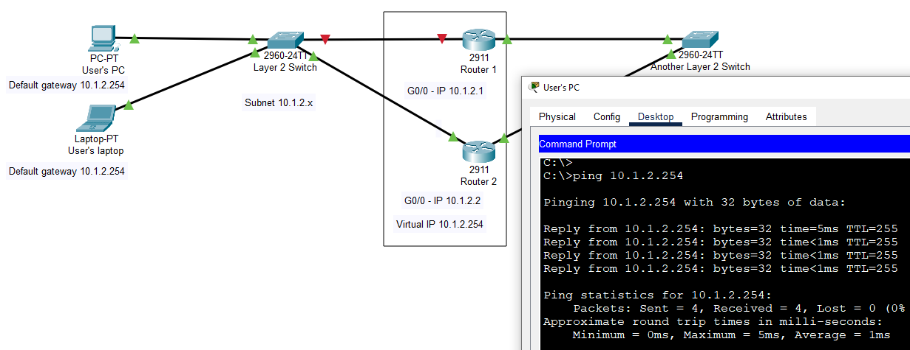
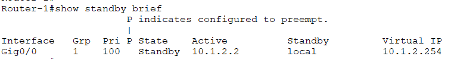
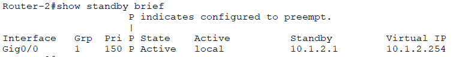
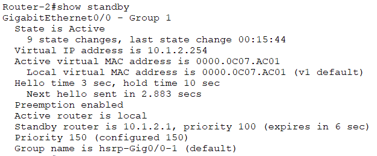

Following on the last post, I want to explain FHRP, First Hop Redundancy Protocol. Another key topic in the CCNA 200-301 exam.

First Hop Redundancy Protocol is a concept of multiple routers in the same subnet as one router. Let’s say you have a key router and the router performs packet-forwarding operations. But the router could be down for several seconds. What then? Your colleagues are not happy because they can’t do their jobs. One point of failure isn’t ideal.



The First Hop Redundancy Protocol options are Hot Standby Router Protocol (HSRP), Virtual Router Redundancy Protocol (VRRP) and Gateway Load Balancing Protocol (GLBP). It’s good to know the options available to you but the Hot Standby Router Protocol is covered in the CCNA only.

The Hot Standby Router Protocol is a Cisco proprietary First Hop Redundancy Protocol to mark the routers as active or standby, to monitor the situation and adjust accordingly automatically. Let’s say that 2 routers have the same virtual IP. One router is active and another is on standby. If the active router fails for any reason, the standby router takes charge without affecting the network for the end users.

Notice that the end user’s computers use the virtual IP as the default gateway now.



To configure the routers to use Hot Standby Router Protocol:
```
Router-1>en
Router-1#conf t
Router-1(config)#interface g0/0
Router-1(config-if)#ip address 10.1.2.1 255.255.255.0
Router-1(config-if)#standby 1 ip 10.1.2.254
```
```
Router-2>en
Router-2#conf t
Router-2(config)#interface g0/0
Router-2(config-if)#ip address 10.1.2.2 255.255.255.0
Router-2(config-if)#standby 1 ip 10.1.2.254
```

To verify the routers using the Hot Standby Router Protocol:
```
Router-1#show standby brief
```



```
Router-2#show standby brief
```



Or, if you want an in-depth look use ```show standby``` instead:



Regarding key details above:

* Virtual MAC address is the same address minus the last 3 hexadecimal digits, which is the standby group number, 1 in our case. We are configuring version 1 in this post, the default version. If you want to configure IPv6 as well, use this command to update the version:
```
Router-2(config-if)#standby version 2
```
* Priority defaults to 100 but you can change that by using, for example:
```
Router-2(config-if)#standby 1 priority 150
```
* Preemption is disabled but you can change that as well by using, for example:
```
Router-2(config-if)#standby 1 preempt
```
So, router 2 has a priority over router 1 in this case.